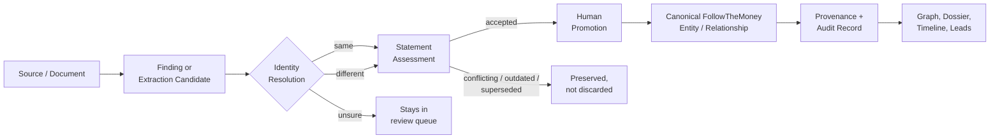

# Journalism Workbench

[](https://github.com/onysnow/Private-ai/actions/workflows/codeql.yml) [](LICENSE)

**An evidence-first investigative research platform — built for humans, not for an LLM to guess with.**

Journalism Workbench helps investigators build evidence-backed cases: collect sources, resolve entities, map relationships, track claims, and preserve exactly where every conclusion came from. It runs entirely without a local or cloud AI model — reasoning over your evidence graph is an optional layer on top, not the foundation underneath.

> **Why that matters:** an external database match, an OCR'd document, or a model's guess is never treated as fact. Every one of them enters the system as a *lead* or a *proposal*. A human reviewer explicitly resolves identity, assesses the statement, and promotes it before it becomes part of the canonical record — and rejected or superseded evidence is preserved, not deleted.

## The core workflow



Nothing skips the human-review step. Nothing gets silently merged or overwritten.

## What's actually built

- **Investigations, entities, and evidence** on a [FollowTheMoney](https://github.com/opensanctions/followthemoney) data model — relationships (ownership, directorship, employment, etc.) are first-class FtM entities, not flattened graph edges, so every relationship carries its own provenance-bearing statements.
- **Exact provenance.** Evidence locators carry precise character offsets (`line N@chars:start-end`), not approximate page references — the accepted text is validated against the exact source slice at promotion time.
- **Non-destructive entity resolution.** Duplicate candidates go through reporter review → merge preview (with dependency analysis and a verified digest) → transactional merge. The source entity survives as a merged alias with a full audit snapshot, not a deletion.
- **Multi-provider connectors** (Aleph/OpenAleph, OpenSanctions, with a modular architecture for more) that keep each provider's findings separate and auditable — cross-provider matches are surfaced for reporter comparison, never silently reconciled.
- **A bounded AI reasoning boundary.** When enabled, the AI assistant endpoint only ever sees a retrieval packet built from reviewed canonical/evidentiary material, with external leads kept in a clearly separate bucket — the model can't cite something a human hasn't already reviewed. Reasoning output (TAS Case Synthesis / Hypothesis Test) lands in a review queue as an `AIAnalysisCandidate` — listed, read and accepted/rejected from the "AI reasoning" panel — and never writes a canonical record; `GET /api/settings/status` reports under `ai` whether the endpoints are callable and which vendored TAS spec version the prompts are built from.
- **Investigation-scoped authorization** (viewer / reporter / admin) enforced at the ORM flush level, not just in route handlers, plus persisted API identities with token rotation/revocation.
- **A 200+ test regression suite** covering the invariants that actually matter here — non-auto-promotion, merge provenance preservation, destructive-action authorization, cross-provider isolation — not just CRUD smoke tests.

Full architectural reasoning and ownership boundaries (what this app owns vs. what it delegates to the FollowTheMoney/OpenAleph ecosystem) are in [`STACK_OWNERSHIP.md`](STACK_OWNERSHIP.md).

## Screenshots

_Coming shortly — the local UI is being captured live._

## Current status — read this before judging "done"

This project has been developed iteratively -- product-facing milestones live in [`CHANGELOG.md`](CHANGELOG.md), and the underlying session-by-session engineering log (PR triage, CI diagnosis, individual audit-finding remediation) lives in [`dev-log.md`](dev-log.md) -- and with a consistently honest practice of naming what's *not* yet proven, not just what's built. As of this writing:

| Area | Status |
|---|---|
| Core reporter workflow (source → evidence → claim → relationship → dossier → lead) | Validated — regression suite passing against SQLite |
| Backend test suite against a **real PostgreSQL** server | Validated — running in CI ([backend-postgres-ci.yml](.github/workflows/backend-postgres-ci.yml)) |
| **Docker** build/boot of the full stack | Validated — running in CI ([docker-build.yml](.github/workflows/docker-build.yml)) |
| Frontend (Next.js) production build/typecheck | Validated — running in CI |
| Dependency security posture | Actively patching ([issue #20](https://github.com/onysnow/Private-ai/issues/20)) — a critical Next.js CVE and several high-severity CVEs were found and are being resolved |
| Remote multi-user deployment | Experimental. The trusted deployment model today is a single local workstation owner; treat authentication as access control, not as a production multi-tenant security boundary yet A separate production compose file and runbook now exist — [`docker-compose.prod.yml`](docker-compose.prod.yml) and [`DEPLOYMENT.md`](DEPLOYMENT.md) (secrets required, no source bind-mount, loopback-only behind your TLS proxy, rollback via `alembic downgrade` and the portable backup feature) — validated by the config test suite, not yet by a live deployment. |

I'd rather this table be accurate than impressive. The architecture and domain modeling are the mature part of this project; production-hardening the deployment story is the current, active work — you're looking at it happen in CI on every push, not just taking my word for it.

## Running it locally (Windows, no Docker required)

1. Extract/clone the repo to a normal writable folder. This repo has one git submodule ([`topic-authority-system`](https://github.com/onysnow/topic-authority-system) at `backend/app/ai/tas_spec/`, the standalone evidence-discipline methodology behind the AI reasoning layer); run `git submodule update --init --recursive` after cloning if you're doing full development rather than just running the app (the launcher below doesn't require it).
2. Double-click **`Start Journalism Workbench.bat`**.
3. First run creates a private `.venv`, installs pinned dependencies, and verifies imports before marking setup complete. Requires Python 3.12 (the launcher will try to install it via `winget` if missing).
4. The app opens at `http://127.0.0.1:8000`, backed by a local SQLite database (`backend/journalism.db`). No PostgreSQL, no Node.js, no Docker needed for this mode.

If setup fails, check `journalism-workbench-setup.log` and run **`Repair Journalism Workbench.bat`**.

### Full stack (Next.js UI + Postgres + OpenAleph), once #6 lands

```bash
docker compose up --build
```

The default stack starts the Workbench database, API, and Next.js UI: use `http://localhost:3000` for the UI and `http://localhost:8000/docs` for API docs. A database inspector (Adminer) is at `http://localhost:8081` — System `PostgreSQL`, Server `workbench-db`, Username `journalism`, Password `POSTGRES_PASSWORD` (default `journalism-local-dev`), Database `journalism`.

Docker Compose wires a localhost-only development bearer token between the frontend and backend automatically so the browser UI can talk to the containerized API through the published `localhost` port. Override `API_AUTH_TOKEN` in your shell or `.env` if you want a different local token.

OpenAleph is part of the stack, not an add-on: `docker compose up --build` boots the workbench **and** the local OpenAleph services (Postgres 17, Elasticsearch, Redis, ingest/analyze workers, API and UI), with the backend wired to it (`OPENALEPH_ENABLED=true` by default). The OpenAleph API is at `http://localhost:8001` and its UI at `http://localhost:8080`. Elasticsearch wants about 1 GB of heap (`OPENALEPH_ES_JAVA_OPTS`); on a small machine you can still run the workbench alone with `OPENALEPH_ENABLED=false docker compose up workbench-db backend frontend adminer`, but that is a reduced mode, not the product.

To have uploads flow into the OpenAleph corpus automatically and let OpenAleph's `ftm-analyze` own entity extraction:

```bash
OPENALEPH_AUTO_SYNC_DOCUMENTS=true ENABLE_LOCAL_ENTITY_SUGGESTIONS=false docker compose up --build
```

## Inspecting the backend

Everything the backend does is viewable without leaving the machine. Start from the
**backend console** and branch out:

| Surface | Where | What it shows |
|---|---|---|
| Backend console | `http://127.0.0.1:8000/console` (also `/console` in the Next.js app) | Database status and every table with live row counts on **any** dialect — including the SQLite file the Windows launcher uses, which Adminer cannot open; page through rows; run read-only SQL; the complete route table with a live probe of the id-free endpoints; run the real test suite against an isolated database and watch it; the structured application log (every request with status/duration, every unhandled error with its traceback, searchable by request id); the security alert counts. Loopback-only. |
| Swagger / ReDoc | `http://127.0.0.1:8000/docs`, `/redoc` | Every endpoint with its schema, callable in the browser. |
| Adminer | `http://127.0.0.1:8081` (Docker: `docker compose up -d workbench-db adminer`) | Browse **and edit** rows in the Postgres database. Server `workbench-db`, user `journalism`, password `POSTGRES_PASSWORD` (`journalism-local-dev` by default). The Windows launcher now uses this Postgres automatically when the container is running, so what you do in the app is what Adminer shows. |
| OpenAleph UI | `http://localhost:8080` | The corpus side: collections, ingested documents, extracted entities. |
| Settings → status | `GET /api/settings/status` | Config as the running process sees it (database, storage, access mode, connectors, AI provider and limits, TAS spec version, security denials). |
| Security audit | `GET /api/settings/security/audit`, `…/summary`, `…/alerts` | The tamper-evident JSONL of every write and every denial. |
| AI trace | any AI analysis candidate → "What the model was sent" | The exact system prompt and retrieval packet a reasoning run used, beside its output. |
| CI | GitHub Actions on every push | Backend suite on real PostgreSQL, mypy + ruff, Docker build, frontend build/tests. |

Data changes are deliberate: the console refuses anything but `SELECT`/`WITH`/`EXPLAIN`
and rolls back every query; edits happen in Adminer, where you can see exactly what you
are changing.

## Security

See [`SECURITY.md`](SECURITY.md) for the vulnerability reporting process. Short version: this is designed for a trusted local workstation today; don't expose it to the open internet without treating the shared-bearer/remote-identity model as experimental.

## Development history

The full DEV 0.7 → DEV 1.24 iteration log — including every architectural decision, ownership boundary, and validation gate along the way — lives in [`CHANGELOG.md`](CHANGELOG.md). For the engineering work since DEV 1.24 (the `routes.py` module split, the ongoing structural audit tracked in [`STRUCTURE_AUDIT.md`](STRUCTURE_AUDIT.md), and everything else at session granularity), see [`dev-log.md`](dev-log.md).
