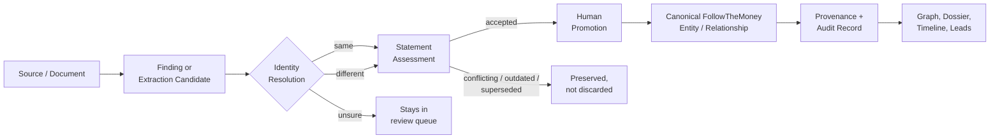

# Journalism Workbench

[](https://github.com/onysnow/Private-ai/actions/workflows/codeql.yml) [](LICENSE)

**An evidence-first investigative research platform — built for humans, not for an LLM to guess with.**

Journalism Workbench helps investigators build evidence-backed cases: collect sources, resolve entities, map relationships, track claims, and preserve exactly where every conclusion came from. It runs entirely without a local or cloud AI model — reasoning over your evidence graph is an optional layer on top, not the foundation underneath.

> **Why that matters:** an external database match, an OCR'd document, or a model's guess is never treated as fact. Every one of them enters the system as a *lead* or a *proposal*. A human reviewer explicitly resolves identity, assesses the statement, and promotes it before it becomes part of the canonical record — and rejected or superseded evidence is preserved, not deleted.

## The core workflow



Nothing skips the human-review step. Nothing gets silently merged or overwritten.

## What's actually built

- **Investigations, entities, and evidence** on a [FollowTheMoney](https://github.com/opensanctions/followthemoney) data model — relationships (ownership, directorship, employment, etc.) are first-class FtM entities, not flattened graph edges, so every relationship carries its own provenance-bearing statements.
- **Exact provenance.** Evidence locators carry precise character offsets (`line N@chars:start-end`), not approximate page references — the accepted text is validated against the exact source slice at promotion time.
- **Non-destructive entity resolution.** Duplicate candidates go through reporter review → merge preview (with dependency analysis and a verified digest) → transactional merge. The source entity survives as a merged alias with a full audit snapshot, not a deletion.
- **Multi-provider connectors** (Aleph/OpenAleph, OpenSanctions, with a modular architecture for more) that keep each provider's findings separate and auditable — cross-provider matches are surfaced for reporter comparison, never silently reconciled.
- **A bounded AI reasoning boundary.** When enabled, the AI assistant endpoint only ever sees a retrieval packet built from reviewed canonical/evidentiary material, with external leads kept in a clearly separate bucket — the model can't cite something a human hasn't already reviewed.
- **Investigation-scoped authorization** (viewer / reporter / admin) enforced at the ORM flush level, not just in route handlers, plus persisted API identities with token rotation/revocation.
- **A 200+ test regression suite** covering the invariants that actually matter here — non-auto-promotion, merge provenance preservation, destructive-action authorization, cross-provider isolation — not just CRUD smoke tests.

Full architectural reasoning and ownership boundaries (what this app owns vs. what it delegates to the FollowTheMoney/OpenAleph ecosystem) are in [`STACK_OWNERSHIP.md`](STACK_OWNERSHIP.md).

## Screenshots

_Coming shortly — the local UI is being captured live._

## Current status — read this before judging "done"

This project has been developed iteratively with a detailed dev log (see [`CHANGELOG.md`](CHANGELOG.md)) and a consistently honest practice of naming what's *not* yet proven, not just what's built. As of this writing:

| Area | Status |
|---|---|
| Core reporter workflow (source → evidence → claim → relationship → dossier → lead) | Validated — regression suite passing against SQLite |
| Backend test suite against a **real PostgreSQL** server | In progress ([PR #5](https://github.com/onysnow/Private-ai/pull/5)) — previously only exercised against SQLite |
| **Docker** build/boot of the full stack | In progress ([PR #6](https://github.com/onysnow/Private-ai/pull/6)) — previously undemonstrated; no Docker runtime in the original dev environment |
| Frontend (Next.js) production build/typecheck | In progress ([PR #4](https://github.com/onysnow/Private-ai/pull/4)) — previously undemonstrated; no npm registry access in the original dev environment |
| Dependency security posture | Actively patching ([issue #20](https://github.com/onysnow/Private-ai/issues/20)) — a critical Next.js CVE and several high-severity CVEs were found and are being resolved |
| Remote multi-user deployment | Experimental. The trusted deployment model today is a single local workstation owner; treat authentication as access control, not as a production multi-tenant security boundary yet |

I'd rather this table be accurate than impressive. The architecture and domain modeling are the mature part of this project; production-hardening the deployment story is the current, active work — you're looking at it happen in the linked PRs above, not just taking my word for it.

## Running it locally (Windows, no Docker required)

1. Extract/clone the repo to a normal writable folder. This repo has one git submodule ([`topic-authority-system`](https://github.com/onysnow/topic-authority-system) at `backend/app/ai/tas_spec/`, the standalone evidence-discipline methodology behind the AI reasoning layer); run `git submodule update --init --recursive` after cloning if you're doing full development rather than just running the app (the launcher below doesn't require it).
2. Double-click **`Start Journalism Workbench.bat`**.
3. First run creates a private `.venv`, installs pinned dependencies, and verifies imports before marking setup complete. Requires Python 3.12 (the launcher will try to install it via `winget` if missing).
4. The app opens at `http://127.0.0.1:8000`, backed by a local SQLite database (`backend/journalism.db`). No PostgreSQL, no Node.js, no Docker needed for this mode.

If setup fails, check `journalism-workbench-setup.log` and run **`Repair Journalism Workbench.bat`**.

### Full stack (Next.js UI + Postgres + OpenAleph), once #6 lands

```bash
docker compose up --build
```

Workbench UI at `http://localhost:3000`, API docs at `http://localhost:8000/docs`, OpenAleph at `http://localhost:8080`.

## Security

See [`SECURITY.md`](SECURITY.md) for the vulnerability reporting process. Short version: this is designed for a trusted local workstation today; don't expose it to the open internet without treating the shared-bearer/remote-identity model as experimental.

## Development history

The full DEV 0.7 → DEV 1.24 iteration log — including every architectural decision, ownership boundary, and validation gate along the way — lives in [`CHANGELOG.md`](CHANGELOG.md).
